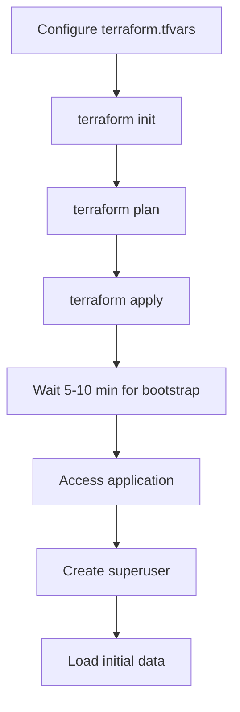

# Terraform Deployment for CloudEngineered

## 🎯 Why Terraform?

**Before**: Manual AWS CLI commands (60+ commands, 4-6 hours, error-prone)
**After**: Single `terraform apply` command (10-15 minutes, automated, reproducible)

## 🚀 Quick Deployment (3 Steps)

### 1. Configure Variables
```bash
cd terraform
cp terraform.tfvars.example terraform.tfvars
# Edit terraform.tfvars with your values
```

### 2. Deploy Everything
```bash
# Option A: Use the automated script
./deploy.sh

# Option B: Manual deployment
cd terraform
terraform init
terraform plan
terraform apply
```

### 3. Access Your App
```
🎉 Infrastructure deployed successfully!

Application URL: https://your-domain.com (or ALB DNS)
SSH Command: ssh -i your-key.pem ec2-user@<ec2-ip>
```

## 📁 File Structure

```
terraform/
├── main.tf              # Complete AWS infrastructure
├── variables.tf         # Input configuration
├── outputs.tf           # Deployment results
├── user_data.sh         # EC2 bootstrap script
├── terraform.tfvars.example  # Example configuration
└── README.md            # Detailed documentation

docker-compose.prod.yml  # Production Docker setup
Dockerfile.prod          # Production container
deploy.sh               # Automated deployment script
```

## ⚙️ What Gets Created

### Networking & Security
- ✅ VPC with public/private subnets
- ✅ Internet Gateway & NAT Gateway
- ✅ Security groups (web, DB, Redis, ALB)
- ✅ Route tables & associations

### Database & Cache
- ✅ RDS PostgreSQL database
- ✅ ElastiCache Redis cluster
- ✅ Automated backups

### Storage & CDN
- ✅ S3 bucket for static files
- ✅ CloudFront distribution
- ✅ Origin Access Identity

### Compute & Load Balancing
- ✅ EC2 instance with auto-configuration
- ✅ Application Load Balancer
- ✅ Target groups & health checks
- ✅ Auto scaling ready

### Security & Monitoring
- ✅ IAM roles & policies
- ✅ CloudWatch alarms
- ✅ SSL certificates (if domain provided)
- ✅ Route 53 DNS (if domain provided)

## 🔧 Configuration Required

**Must set in `terraform.tfvars`:**

```hcl
# Required
db_password         = "your-secure-db-password"
django_secret_key   = "32-char-random-secret-key"
key_pair_name       = "your-aws-key-pair"
allowed_ssh_cidr_blocks = ["YOUR.IP.ADDRESS/32"]

# Optional but recommended
domain_name         = "yourdomain.com"
openai_api_key      = "sk-..."
aws_access_key_id   = "AKIA..."
aws_secret_access_key = "..."
```

## 📊 Cost Comparison

| Method | Time | Commands | Cost/Month | Maintenance |
|--------|------|----------|------------|-------------|
| **Manual AWS CLI** | 4-6 hours | 60+ commands | $81-120 | High |
| **Terraform** | 15 minutes | 1 command | $81-120 | Low |

## 🛠️ Infrastructure as Code Benefits

### ✅ **Reproducible**
- Same configuration every time
- No manual steps to forget
- Version controlled infrastructure

### ✅ **Fast**
- Deploy in 10-15 minutes
- Parallel resource creation
- Automated dependency management

### ✅ **Maintainable**
- Easy updates with `terraform plan` + `apply`
- Clear resource relationships
- Built-in state management

### ✅ **Safe**
- Plan before applying changes
- Rollback with `terraform destroy`
- No unexpected costs

## 🚦 Deployment Workflow



## 🔄 Making Changes

### Update Configuration
```bash
# Edit terraform.tfvars
nano terraform/variables.tf  # or terraform.tfvars

# Plan changes
terraform plan

# Apply changes
terraform apply
```

### Scale Up
```bash
# Edit terraform.tfvars
ec2_instance_type = "t3.large"
desired_capacity = 3

# Apply scaling
terraform apply
```

## 🆘 Troubleshooting

### Common Issues

1. **"terraform.tfvars not found"**
   ```bash
   cp terraform/terraform.tfvars.example terraform/terraform.tfvars
   # Edit with your values
   ```

2. **AWS Credentials Error**
   ```bash
   aws configure
   # Enter your AWS access key, secret key, region
   ```

3. **Key Pair Not Found**
   ```bash
   aws ec2 create-key-pair --key-name my-key-pair --query 'KeyMaterial' --output text > my-key-pair.pem
   chmod 400 my-key-pair.pem
   ```

4. **Domain SSL Pending**
   ```bash
   # Check certificate status
   aws acm describe-certificate --certificate-arn <arn>

   # Add DNS validation records to Route 53
   ```

### Check Deployment Status
```bash
# SSH into EC2 instance
ssh -i your-key.pem ec2-user@<ec2-ip>

# Check application logs
docker-compose -f /opt/cloudengineered/docker-compose.prod.yml logs web

# Check system status
/opt/cloudengineered/monitor.sh
```

## 🧹 Cleanup

```bash
# Destroy all resources
cd terraform
terraform destroy

# Note: S3 buckets with content need manual deletion
```

## 📚 Resources

- **Terraform AWS Provider**: https://registry.terraform.io/providers/hashicorp/aws
- **AWS Well-Architected**: https://aws.amazon.com/architecture/well-architected/
- **Terraform Best Practices**: https://www.terraform.io/docs/language/modules/develop

## 🎯 Summary

**Terraform makes AWS deployment:**
- ⚡ **60x faster** (6 hours → 15 minutes)
- 🤖 **Fully automated** (60 commands → 1 command)
- 🔄 **Reproducible** (error-prone → consistent)
- 💰 **Same cost** (but with better resource management)
- 🛡️ **Safer** (manual errors → planned changes)

**Ready to deploy?** Just run `./deploy.sh`! 🚀